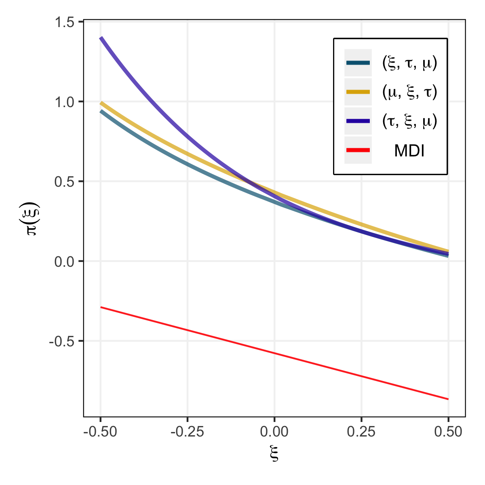

# Reference priors for Generailized Extreme Distributions (GEV)

Reference prior proposed by Bernando (2005) is a formal rule to select non-informatic priors by maximizing the _missing_ information within the class of candidate priors.

## Different priors of interest
1. Beta prior (Martins et al. 2000);
2. Reference prior under ordered parametrization (ξ, τ, μ);
3. Reference prior under ordered parametrization (μ, ξ, τ);
4. Reference prior under ordered parametrization (τ, ξ, μ);
5. MDI prior (Zellner 1971).

## Evaluate the posterior
For each prior, we evaluate the posterior using Metropolis random walk. 

